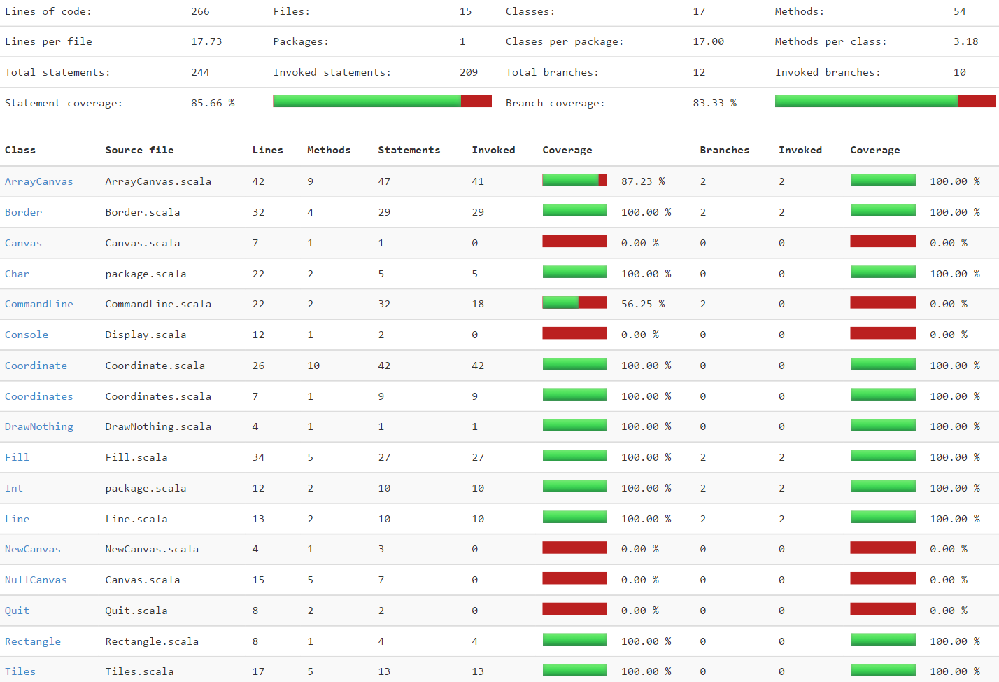

# Springer Coding Exercise

Ensure you have `sbt` setup then run the following from the project root.

    sbt run

## Notes & Comments

### Coordinate System

The coordinate system starts at 1 for `x` and `y` axis. Ordinating the top left corner. So `Coordinate(1, 1)` is the first drawable position (it correlates to the Java convention of `(0, 0)`).

### Use of Exceptions

I'm in two minds about using exceptions. I started by preventing an invalid coordinate being created by throwing an exception but switched to just ignoring out of range coordinates when applied to the canvas. I decided that "coordinates are coordinates", so even (-34, -23) is "valid", it's only the context of applying them to the canvas that gives us enough to work out if they are really valid.

### Shape Types & Immutability

I used sub-types of `Shape` to represent lines and rectangles that can draw themselves. The rectangle implementation was fairly quick as it builds the rectangle in terms of four lines which are applied to the canvas in turn. It got me thinking about what would happen if any one of the four failed for some reason.

This lack of atomicity made me think about using a more immutable style canvas where potential updates (like applying a shape to a canvas) result in `Either` an update or nothing. You could then replace the entire (old) canvas with a newly updated one on success.

### Test Coverage

Full disclosure: I don't have 100% test coverage. I don't think I need it. Some bits (notably the `CommandLine` class) are not tested with automated tests. This is partly because I wasn't test driving at this point (I'd already settled on a design) and partly because finer grained testing was done elsewhere. I'm happy to discuss in more depth.

## Hardware Integration

For fun, I integrated the code to work with a Raspberry Pi fitted with an 8x8 LED matrix. Because the Pi requires `sudo` access to write to the GPIO pins, you have to run `sbt` with privileges to see the blinky lights. Follow these steps.

    git checkout raspberry_pi
    sudo sbt run

Colour selection is as follows;

* Borders are red
* Lines and rectangles are blue
* Bucket fill uses a colour code; `g` is green, `y` is yellow and so on. An unknown colour code defaults to magenta
